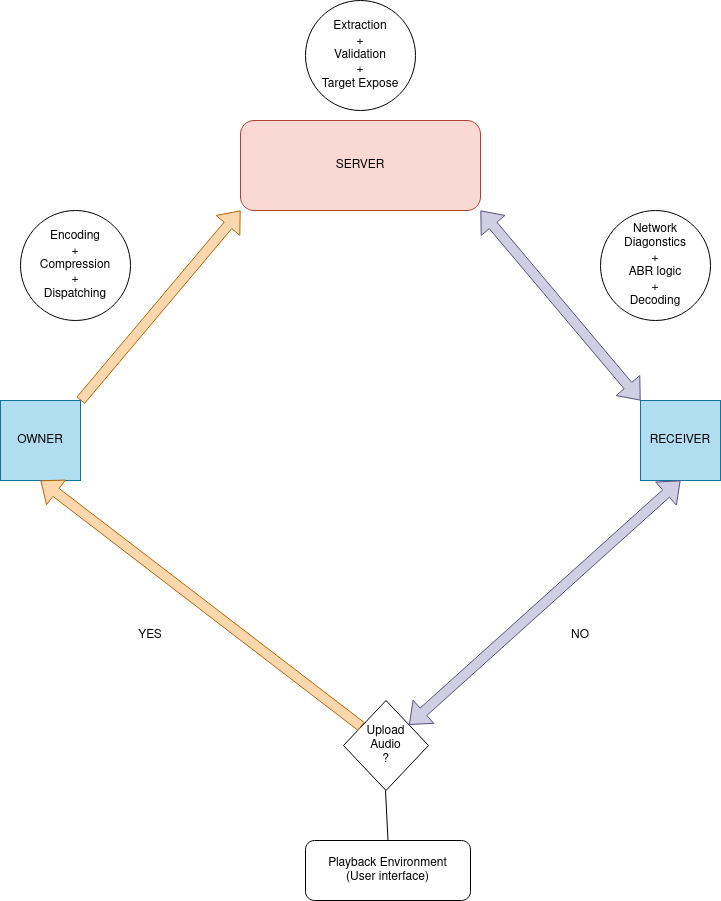

# **Wavy**

A **local networking solution** for **audio streaming and sharing**, supporting **lossless and lossy audio formats** through a unified platform.

> [!IMPORTANT]
> 
> Wavy is still under heavy development (**WIP**)
> 
> Expect a **LOT** of breaking changes with each commit.
> 

## **Table of Contents**
- [**Introduction**](#introduction)
- [**Dependencies**](#dependencies)
- [**Building**](#building)
- [**Architecture**](#architecture)
- [**Security**](#security)
- [**API References**](#api-references)
- [**Examples**](#examples)
- [**Server**](#server)
- [**Usage**](#usage)
- [**Documentation**](#documentation)
- [**License**](#license)

## **Introduction**
Wavy is a **lightweight** and **efficient** solution for audio streaming within a local network. It is designed to **encode, decode, and dispatch** audio streams seamlessly while ensuring **secure** data transfer via **SSL/TLS encryption**.

> [!IMPORTANT]
> 
> The Wavy Project currently is only supported for *NIX Operating Systems (on x86-64 architecture).
> 
> 
> Currently supported and tested distributions:
> 
> 1. Arch Linux
> 2. Ubuntu (Debian)
> 3. Fedora
> 
> In the future, perhaps Windows / MacOS will be supported.

It supports:
- **Lossless formats** (FLAC, ALAC, WAV)
- **Lossy formats** (MP3, AAC, Opus, Vorbis)
- **Adaptive bitrate streaming** (Soon) using **HLS (HTTP Live Streaming)**.
- **Metadata extraction** and **TOML-based** configuration.
- **Transport stream decoding** via **FFmpeg** for real-time audio playback.

## **Dependencies**
To build and run **Wavy**, install the following dependencies:

| Dependency  | Purpose |
|-------------|---------|
| **FFmpeg**  | Audio encoding, decoding, and streaming |
| **Base-devel** | Includes `g++` / `clang++` for C++ compilation |
| **OpenSSL** | Secure communication using SSL/TLS |
| **Boost C++** | Asynchronous networking & utility functions |
| **Intel oneTBB** | Parallelism for Wavy operations |
| **libzstd** | Lossless compression (Zstandard) |
| **CMake & Make** | Build system tools |
| **Pkg-Config** | Build system tools helper |
| **Libarchive** | Handling `.tar`, `.gz`, `.zst` compressed files |
| **libmp3lame** | MP3 encoding support |

### **Optional Dependencies (for Lossless Support)**

| Dependency  | Purpose |
|-------------|---------|
| **FLAC & FLAC++** | FLAC decoding and encoding for lossless streaming |
| **Qt6** (_Core, Widgets_) | Required for GUI development. |

> [!NOTE] 
> 
> Ensure that **FFmpeg** is installed with `libavformat`, `libavcodec`, `libavutil`, and `libswresample`
> 
> This is particular critical for Ubuntu / Debian: (FFmpeg and its dev libs are different packages)
> 
> ```bash 
> sudo apt install ffmpeg libavcodec-dev libavformat-dev libavutil-dev libavfilter-dev libswscale-dev libswresample-dev
> ```
> 
> On Arch Linux: 
> ```bash 
> sudo pacman -S ffmpeg # should be enough
> ```
> 

## **Building**

The Wavy Project uses a simple Makefile to run simple and straightforward functions that acts as a wrapper around the CMake Build System 
that currently creates and links different binaries that are **NOT** integrated yet!

To initialize the project:

```bash 
make init
```

To compile the different components, run:

```bash
make encoder     # Builds encode.cpp
make decoder     # Builds decode.cpp
make dispatcher  # Builds dispatcher for stream management
make server      # Builds the Wavy streaming server
make remove      # Cleans up all generated transport streams and playlists

make all         # Builds all components at once
```

If you want to build the server without **FFmpeg** and **oneTBB**:

```bash 
make server EXTRA_CMAKE_FLAGS="-DNO_FFMPEG=ON -DNO_TBB=ON"
```

### Containerized Server

To run the Wavy server in a **Docker** container:

```bash 
docker build -t wavy-server . # to build the container
docker run -d -p 8080:8080 --name wavy-server-test wavy-server
```

> [!IMPORTANT]
> 
> If you want to contribute to Wavy and want compile times 
> for each binary to be faster, here are a few steps that are recommended:
> 
> 1. Use Ninja with the existing build system:
> 
> ```bash 
> make server EXTRA_CMAKE_FLAGS="-DBUILD_NINJA=ON" # add the BUILD_NINJA flag when making a target
> ```
> 
> This should compile with parallelism and should give faster builds.
> 
> 2. Use Mold as the linker:
> 
> ```bash
> make all EXTRA_CMAKE_FLAGS="-DUSE_MOLD=ON" # add USE_MOLD flag when making a target
> ```
> 
> This will try to use [mold](https://github.com/rui314/mold) as the linker for the project.
> You can try different flags but it is recommended that you do not. It is not necessary.
> 
> Mold is significantly smarter and faster than GNU's `ld` and CLANGs `lld` and this should help in 
> faster build and linking times for the project.
> 


## **Architecture**
The **Wavy** system consists of the following components:

- **Encoder:** Converts audio files into **HLS (HTTP Live Streaming) format**.
- **Decoder:** Parses transport streams for playback.
- **Dispatcher:** Manages transport stream distribution.
- **Server:** Handles **secure** file uploads, downloads, and client session management.

**System Overview:**


For a more detailed explanation, read:  
[ARCHITECTURE.md](https://github.com/nots1dd/wavy/blob/main/ARCHITECTURE.md)

## **Security**

We do have a [SECURITY.md](https://github.com/Oinkognito/wavy/blob/main/SECURITY.md).

Since the project is still in **active development**, no absolute promises can be made other than the standards and 
practices of the codebase.

## **API References**
Wavy relies on **FFmpeg's core libraries** for processing audio:

- [`libavformat`](https://ffmpeg.org/libavformat.html) - Format handling & demuxing.
- [`libavcodec`](https://ffmpeg.org/libavcodec.html) - Audio decoding & encoding.
- [`libavutil`](https://ffmpeg.org/libavutil.html) - Utility functions for media processing.
- [`libswresample`](https://ffmpeg.org/libswresample.html) - Audio resampling & format conversion.

For detailed API documentation, see:  
[APIREF.md](https://github.com/nots1dd/wavy/blob/main/APIREF.md)

## **Examples**

Wavy currently is under heavy development as mentioned above, so for people to understand the project better,
the project maintains an `examples/` directory. Latest `libwavy` APIs are made sure to have atleast one in-depth example 

> [!NOTE]
> 
> To compile all examples:
> 
> ```bash 
> make "-DBUILD_EXAMPLES=ON"
> ```
> 

Each example should be pretty straightforward as they are isolated API calls to a particular aspect of `libwavy`

## **Server**
The **Wavy-Server** allows **secure** transport stream handling over HTTPS.

The Server Storage Organization is indexed below: 

```text 
hls_storage/
├── 192.168.1.10/                                    # IP Address 192.168.1.10 (example)
│   ├── 1435f431-a69a-4027-8661-44c31cd11ef6/        # Randomly generated audio id
│   │   ├── index.m3u8
│   │   ├── hls_mp3_64.m3u8                          # HLS MP3 encoded playlist (64-bit)
│   │   ├── hls_mp3_64_0.ts                          # First transport stream of hls_mp3_64 playlist                
│   │   ├── ...                                      # Similarly for 128 and 256 bitrates
│   │   ├── metadata.toml                            # Metadata and other song information
│   ├── e5fdeca5-57c8-47b4-b9c6-60492ddf11ae/
│   │   ├── index.m3u8
│   │   ├── hls_flac_64.m3u8                         # HLS FLAC encoded playlist (64-bit)
│   │   ├── hls_flac_64_0.ts                         # First transport stream of hls_mp3_64 playlist 
│   │   ├── ...                                      # Similarly for 128 and 256 bitrates
│   │   ├── metadata.toml                            # Metadata and other song information
│    
```

The server does not delete these indices after the server dies. The server allows for **PERSISTENT STORAGE**.

This makes it so that every owner can index multiple audio files under a clean directory structure that is logical to query and playback.

So the capability of the server totally depends on **YOUR** filesystem. This gives you full power to manage your server library to the fullest.

**Current Routes**:

1. `/hls/clients`: Gives a neat hierarchial structure of each Owner-IP-ID with their uploaded audio ids.
2. `/hls/audio-info/`: Provides a neat hierarchial structure of every Audio ID's provided metadata (from their uploaded metadata.toml)
3. `/hls/ping`: A basic route to check if the server is "alive" (sends `pong` if running)

If you want to get the metadata for a single audio-id, you can always just query it like so:

```bash
curl -k -X GET https://<server-ip>:8080/<ip-id>/<audio-id>/metadata.toml 
```

> [!NOTE]
> 
> The Server Architecture and Organization is made in such a manner
> that you will **NEVER** require FFmpeg libraries to be present.
> 
> This reduces any dependencies and complications in your server,
> and overall reduces load of operations.
> 
> It will only require the following:
> 
> 1. Standard C/C++ libs (should be there already)
> 2. Boost C++ (preferably above 1.70)
> 3. OpenSSL 
> 4. ZSTD 
> 

### **Flexibility**

The architecture is designed in a way to make it more flexible in the future.

The server's importance in the overall flow of operations is always kept at a minimum, to ensure that if we were to implement a P2P solution for this someday, the transition and implementation would lead to no heads being bashed into a wall.

### **Generating SSL Certificates**
To generate a **self-signed certificate**, run:

```bash
openssl req -x509 -newkey rsa:4096 -keyout server.key -out server.crt -days 365 -nodes
```

Or use the **Makefile shortcut**:

```bash
make server-cert
```

> [!NOTE] 
> 
> Place `server.crt` and `server.key` in the **current working directory** before starting the server.
> 

> [!WARNING] 
> 
> This is a **self-signed certificate**.  
> - Use `-k` flag in **cURL** to bypass SSL validation.
> - Accept the self-signed certificate when using **VLC/MPV**.
> 

---

## **Usage**
### **Starting the Server**
Once compiled, start the server:

```bash
make run-server
```

It will:
1. Accept secure `.m3u8` & `.ts` uploads.  
2. Assign **UUIDs** to clients for session tracking.  
3. Serve stored playlists via `GET /hls/<ip-id>/<client_id>/<filename>`.

### **Uploading a Playlist**
To upload a **compressed HLS playlist**:

```bash
curl -X POST -F "file=@playlist.tar.gz" https://localhost:8080/upload -k
```

### **Fetching a Client List**
```bash
curl https://localhost:8443/hls/clients -k
```

## **Documentation**
### **Generating Docs**
Install **Doxygen**, then run:

```bash
doxygen .Doxyfile
xdg-open docs/html/index.html  # Opens the documentation in a browser
```

## **Credits**

1. **TOML++**:  Header-only TOML config file parser and serializer for C++17.  [TOML++ (tomlplusplus)](https://github.com/marzer/tomlplusplus)
2. **Miniaudio**:  Audio playback and capture library written in C, in a single source file. [Miniaudio](https://github.com/mackron/miniaudio)

## **License**
The **Wavy Project** is licensed under the **BSD-3-Clause License**.  
[LICENSE](https://github.com/Oinkognito/wavy/blob/main/LICENSE)
